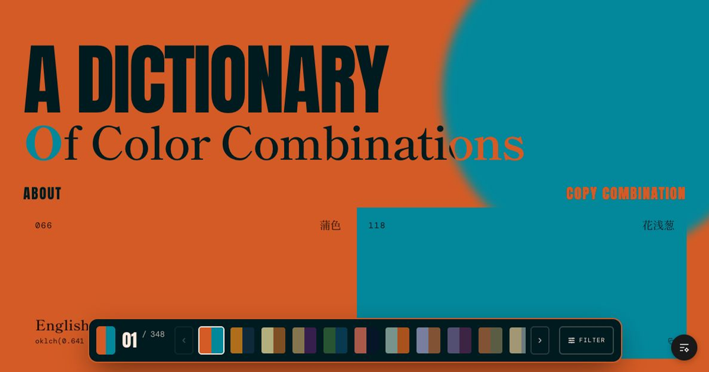
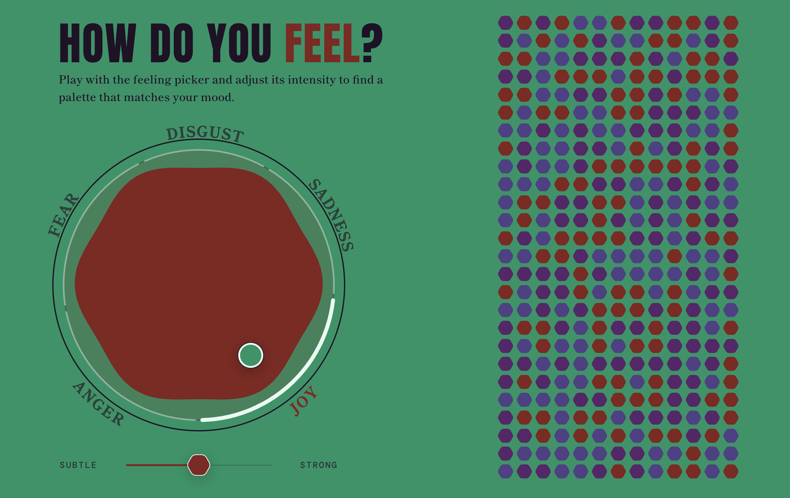
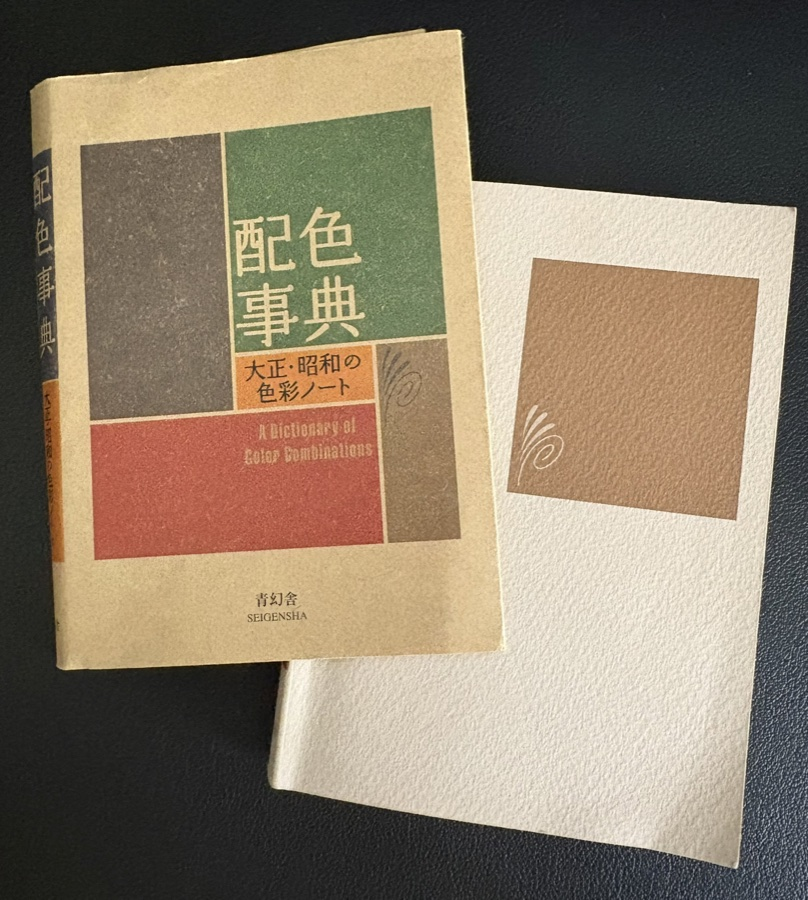

<p align="center">
  <a href="https://colors.marcebollin.com/">
    
  </a>
</p>

<h1 align="center">Sanzo Wada Colors</h1>

<p align="center">
  A digital color dictionary drawn from <em>Haishoku Soukan</em>,<br />
  Sanzo Wada’s six-volume study of color harmony from 1933–34.
</p>

<p align="center">
  <a href="https://colors.marcebollin.com/"><strong>Explore the dictionary ↗</strong></a>
  &nbsp;&nbsp;·&nbsp;&nbsp;
  <a href="https://colors.marcebollin.com/about">Read its story</a>
</p>

<br />

| 348 combinations | 159 named colors | 2–4 colors per palette |
| :---: | :---: | :---: |

> Each combination is both a historical artifact and a working tool: a small,
> deliberate lesson in contrast, balance, and atmosphere.

## Color, first

This project reimagines *A Dictionary of Color Combinations* as an interactive
archive. The page changes character with every selected palette: backgrounds,
type, accents, controls, and motion all respond to the colors in view. There are
no ornamental illustrations competing for attention. The colors are the
interface.

Browse the complete collection, move between combinations with the palette
switcher, filter by color or palette size, and inspect every swatch by its
English and Japanese name. When a combination feels right, copy it as ready-to-use
CSS in **OKLCH, HEX, HSL, or RGB**, or take the book’s original **CMYK** values
into a print workflow.

## Find a palette by feeling

<a href="https://colors.marcebollin.com/feeling">
  
</a>

The **Feeling** experiment approaches the archive from another direction. Pick
a point between joy, sadness, fear, anger, and disgust; tune its intensity; and
the dictionary ranks the combinations that best match the mood. You can also
look for a counter-feeling and export the result as a shareable banner or a
design-and-engineering handoff.

## Made for looking—and using

- **Browse freely.** Explore all 348 combinations through a tactile, responsive
  palette carousel with keyboard navigation.
- **Follow a color.** Select any of the 159 swatches to find every combination
  in which it appears.
- **Copy cleanly.** Export named CSS custom properties in OKLCH, HEX, HSL, or
  RGB, or copy profile-aware CMYK handoff notes.
- **Choose the rendering.** Switch between a color-managed **Profiled** view and
  a fixed-sRGB **Reference** view.
- **See more on capable displays.** The Profiled view uses Display P3 when a
  color and screen can benefit from it, with an sRGB-safe fallback everywhere.
- **Keep the motion, skip the friction.** Palette changes animate across the
  whole composition, while reduced-motion preferences are respected.

## A modern reading of a printed source

Wada (1883–1967) was a Japanese artist, teacher, costume designer, kimono and
fashion designer. His work moved between fine art, theatre, film, and visual
research, but color remained a persistent subject. In *Haishoku Soukan*, he
treated color relationships with the clarity and restraint of a design system
before that language was common.

This site began with a copy of the book found at the Centro Botín museum in
Santander, Spain—and with a wish for a version that could be reached whenever a
project needed a quick, thoughtful combination.

<table>
  <tr>
    <td width="50%" align="center">
      
    </td>
    <td width="50%" align="center">
      
    </td>
  </tr>
  <tr>
    <td align="center"><em>The book</em></td>
    <td align="center"><em>Where this edition was found</em></td>
  </tr>
</table>

## Color provenance

The source CMYK values come from Seigensha’s 2010 revised reproduction of the
dictionary. Because CMYK has no fixed appearance without a printing condition,
the default **Profiled** mode interprets those values through **Japan Color 2001
Uncoated**, stores the resulting media-relative Lab D50 references, and derives
gamut-safe OKLCH values for sRGB and Display P3.

That profile is a reasoned approximation for the modern reproduction—not a
claim about the appearance of Wada’s original 1933–34 swatches. The conversion
decisions, limitations, gamut policy, and regeneration commands are documented
in [Color provenance and gamut policy](./docs/color-provenance.md).

## Run it locally

```bash
pnpm install
pnpm dev
```

Vite will print the local address, usually
[`http://localhost:5173`](http://localhost:5173).

| Command | Purpose |
| --- | --- |
| `pnpm dev` | Start the local development server |
| `pnpm typecheck` | Check the TypeScript project |
| `pnpm lint` | Run Biome linting |
| `pnpm test:colors` | Test the color conversion pipeline |
| `pnpm colors:audit` | Audit regenerated OKLCH gamut values |
| `pnpm build` | Create a production build |

## Under the paper

The interface is built with **React 19**, **TypeScript**, **Vite**, **TanStack
Router**, **Tailwind CSS**, and **Motion**. Its three type voices mirror the
site’s editorial structure: Anton for the oversized display type, Shippori
Mincho for the bookish narrative, and DM Mono for color data and controls.

```text
src/
├── components/   interactive dictionary, palette, and feeling UI
├── data/         159 colors and 348 combinations
├── lib/          theming, gamut, matching, gradients, and motion logic
├── routes/       dictionary, about, explorations, and feeling pages
└── styles/       typography, palette surfaces, and transitions

scripts/          CMYK → Lab D50 → OKLCH conversion and tests
docs/             source, profile, and gamut documentation
```

## Credits

The dictionary and its color combinations are the work of **Sanzo Wada**. This
digital interpretation was designed and built by
[Marcelo Bollin](https://marcebollin.com). The code and data are open here for
anyone curious about the archive, its interface, or its color process.

You can find the current English edition through
[Seigensha](https://en.seigensha.com/books/978-4-86152-247-5/).
